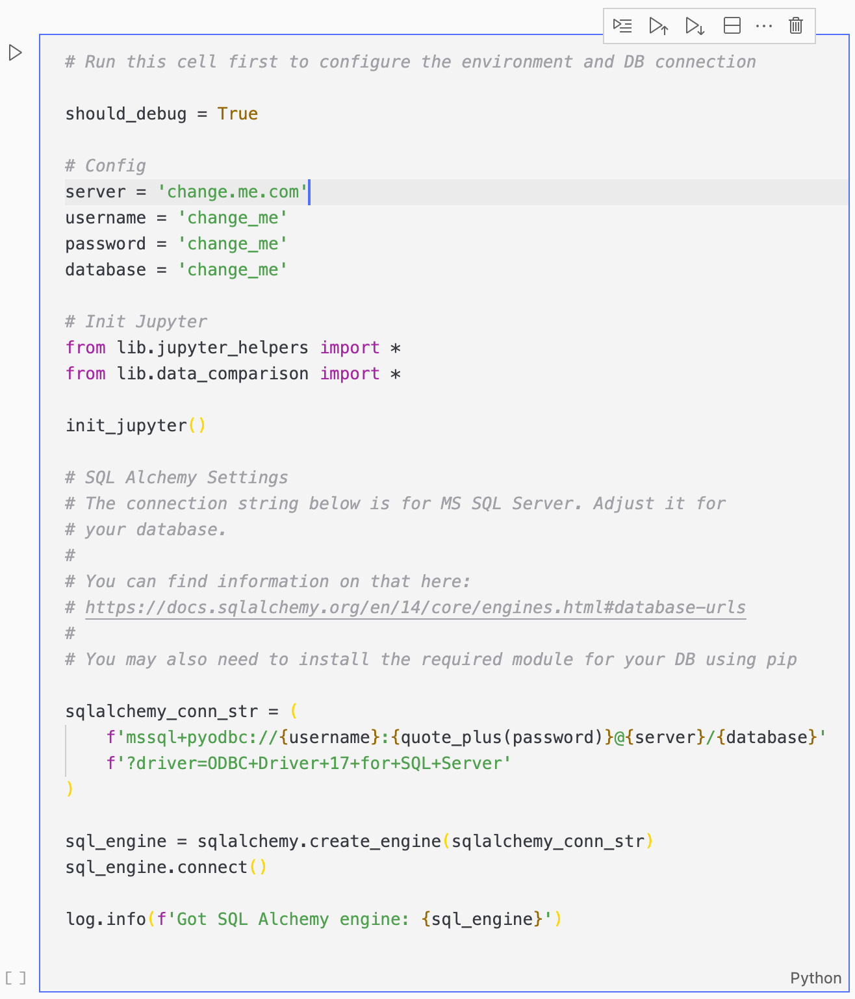

# SQL Data Comparion

## Overview

This is a simple solution to compare two versions of an SQL table or view. It allows you to see...

* Which rows changed
* What columns changed (including previous and new values)
* Which rows were added
* And which rows were deleted

It's a Jupyter notebook that uses python, [pandas](https://pandas.pydata.org) and [datacompy](https://capitalone.github.io/datacompy/) to compare the data. The result is a .txt file with a summary of the changes as well as a SQLite database that lets you query all changed columns and rows in detail.


In the screenshot, you can see a query on the `rows_with_differences` table. This table includes all rows where differences between the two versions were found.

For columns that did have changes (such as the `cta_link` column), you get three columns (`_match`, `_df1` and `_df2`) that let you see what the changes were and easily filter the data.

But columns that had no changes across all rows (such as `ad_name` and `ad_status`), don’t have these additional columns.

This way you can see at a glance what changed, but can also put the changed data into context with the rest of the data for the row.

## Usage

First, you’ll need to clone the code and install the python dependencies…

```bash
cd sql_data_compare
pip install -r requirements.txt
```

Next, you are going to want to open the `data_compare.ipynb` file. 

You can either open it using the jupyter server…

```bash
jupyter notebook data_compare.ipynb
```

Or you can download [VSCode](https://code.visualstudio.com/) and run it through there. That’s is my preferred method.

Once you open the jupyter notebook, you’ll need to adjust the settings.



The solution uses python’s SQLAlchemy module to load the data from a SQL database, then compares it using pandas and datacompy and finally writes the results to an SQLite database.

So the first step is to configure the SQL database settings and the SQLAlchemy connection string.

In the above example, it’s configured to connect to a MS SQL server, but you can change it to any database that SQLAlchemy supports.

You can refer to their database URL documentation for further details.

After that you can start the comparison in the second jupyter cell…


Simply adjust the settings and run it.

You will find the resulting report and SQLite database with the changes in the `./comparison/` directory.
